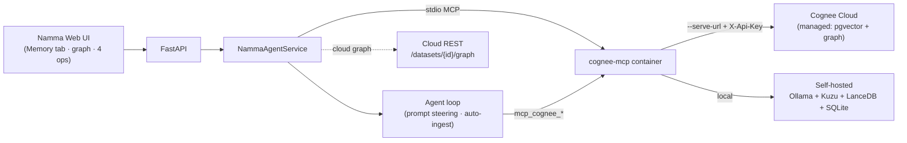

# Namma Agent × Cognee — "Where's My Context?"

> **WeMakeDevs × Cognee Hackathon submission.**
> Repo: https://github.com/SanthoshReddy352/Namma-Agent
> Tracks: **Best Use of Open Source** (self-hosted) **and** **Best Use of Cognee Cloud** — one codebase, both tracks.

## The hook

The Hangover problem: you wake up and the context is *gone*. Namma Agent used to
have the same problem — its memory was a single SQLite file with **keyword search
only**. Ask it "which database engine do I favour?" when you'd said "I prefer Kuzu"
and it drew a blank. The words didn't match, so the memory may as well not exist.

**Cognee fixes the hangover.** Namma now has a semantic + knowledge-graph memory: it
recalls by *meaning* and *relationships*, grows a living graph of your life and
projects, consolidates and forgets — and it does it from inside normal conversation,
not just a settings page.

## Why build Namma Agent at all? (the prior question)

Fair challenge before we talk memory: Claude, ChatGPT, Hermes, OpenClaw, Open
Interpreter and a dozen other agents already exist. Why build *another* one?

Because each of those makes a trade Namma refuses:

- **Hosted assistants (Claude, ChatGPT, Gemini)** are walled gardens. One vendor owns
  the brain, your data lives on their servers, and the capability set is whatever they
  ship. You can't swap the model, run it offline, hand it your own shell, or truly
  *own* the memory.
- **Coding agents** are brilliant but scoped to the repo — they don't find you a PG in
  Bengaluru, run your smart home, teach you a syllabus, or ping you on Telegram.
- **Open-source personal agents (Hermes, OpenClaw, …)** get the *self-hosted* part
  right — Namma is built in that tradition and reaches parity-and-beyond on comms
  bridges, skills, and toolsets — but they stop at a fixed toolset and skip the parts
  below.

Namma Agent is the assistant that stays **yours on every axis**:

| Capability | Namma | Hosted chat (Claude/ChatGPT) | Coding agents | Other OSS agents |
|---|:---:|:---:|:---:|:---:|
| You host it / own your data | ✅ | ❌ | partial | ✅ |
| Any brain — swap provider in one key, offline-capable | ✅ | ❌ one vendor | partial | partial |
| Acts on your real machine + life (~85 tools: shell, files, browser, smart home, Gmail/Calendar) | ✅ | ❌ | code only | partial |
| Writes its own tools + skills at runtime | ✅ | ❌ | ❌ | rare |
| Teaches you (Learning Room pedagogy) | ✅ | ❌ | ❌ | ❌ |
| Persistent, personal memory you own — now a knowledge graph | ✅ | partial (their servers) | ❌ | partial |

Concretely: Namma is **provider-agnostic** (native Anthropic / OpenAI / Google, or any
OpenAI-compatible endpoint, switched with one config key and an automatic fallback
chain across providers), runs its tool-loop over **~85 native tools on *your* machine**,
**extends itself** (`create_tool` writes and hot-loads new Python tools mid-turn; it
authors its own `SKILL.md` playbooks after solving novel tasks), ships a
pedagogy-backed **Learning Room**, and — unlike some OSS agents — **declines the unsafe
shortcuts** (we refused to port Hermes's "God Mode" jailbreak skill).

**And that is exactly why the hangover matters here.** A toy chatbot has no life worth
remembering. Namma is a real daily driver — it finds your flat, plans your project,
reviews your code, runs your home — so the context it accumulates is *real*, and losing
it between sessions genuinely hurts. The more of an agent Namma became, the more its
keyword-only SQLite memory became the bottleneck. Cognee isn't a feature bolted onto a
demo; it's the memory a *working* agent finally deserved.

## All four memory-lifecycle ops — visible and demoable

The grading rewards *depth of memory-lifecycle engagement*. Namma exercises the full
lifecycle, each with a place you can see it in the **Memory** tab:

| Op | In Namma | Where |
|---|---|---|
| **remember** | store a fact (fast session, or permanent build) | Memory → *Remember* |
| **recall** | semantic + graph question answering, even reworded | Memory → *Ask my memory* |
| **improve** (memify / cognify) | *Consolidate* promotes session notes into the graph — entity extraction + linking, the same enrichment step Cognee exposes as `improve`/`memify` | Memory → *Improve memory* |
| **forget** | delete from graph + vector + relational stores | Memory → *Forget* |

Plus the **knowledge graph** itself — an Obsidian-style, force-directed render of
your memory — as the hero of the tab, on **both** backends.

## The money shot — keyword vs semantic

The Memory tab's **Keyword vs Semantic** panel runs the same query two ways: Namma's
original SQLite keyword search (FTS5/BM25) beside Cognee's semantic recall. Reword the
question with words you never stored and keyword search whiffs while Cognee still
answers. That before/after is the whole reason the integration exists.

## Memory in *real* conversation (not just a tab)

Cognee is woven into the agent loop, not bolted on:
- **Auto-ingestion** — normal chats are cognified into the graph in the background
  (opt-in `cognee.auto_ingest`), so the graph grows as you talk.
- **Prompt steering** — when Cognee is connected, the agent is instructed to call
  `mcp_cognee_recall` before answering anything about you, so it **visibly** uses
  Cognee mid-conversation.
- **Airtight recall** (opt-in `cognee.recall_context`) — for "what do you know about
  me?"-style questions, Namma proactively pulls the answer from Cognee so recall is
  guaranteed even across a brand-new chat session.
- **Learning Room** — finishing a module pushes its recap into the graph, so what you
  *study* becomes part of your memory too.

## Architecture — one codebase, two tracks



Namma talks to Cognee **only through MCP tools**, so it doesn't care where Cognee
runs. The single `cognee` server entry is the only thing that differs between tracks
— flipped with one click in **Settings → MCP → Cognee → Backend**. The Memory tab,
the four ops, the graph, and the agent loop are **identical** across both.

- **Track A — Best Use of Open Source (primary, fully live):** self-hosted `cognee-mcp`
  container + Ollama embeddings + Kuzu/LanceDB/SQLite. Runs 100% on your machine, no API
  keys; reproducible with one setup script. Graph renders from the container's
  `visualize_graph_ui`. **This is the recorded demo end-to-end.**
- **Track B — Best Use of Cognee Cloud:** the same image in serve mode against managed
  Cognee Cloud (`--serve-url` + `X-Api-Key`); the cloud owns its DB + embeddings and the
  graph is synced from the cloud REST API (`/api/v1/datasets/{id}/graph`). **Verified
  working end-to-end earlier in prep** (connect → seed → cloud graph sync → recall).

> **Both tracks are fully live.** Cognee Cloud was briefly at capacity during early prep;
> the organizers confirmed **cloud access reopens July 2, 2026**, so both videos are recorded
> live. Because the cloud path is a **one-line MCP-server swap on identical code**, the two
> tracks share one story and one graph — the seed script builds an identical demo graph on
> each backend (`--backend both`), and every clip works on either. See the track-aware
> guides: [`RECORDING_GUIDE_SELFHOSTED.md`](RECORDING_GUIDE_SELFHOSTED.md) (🅰) and
> [`RECORDING_GUIDE_CLOUD.md`](RECORDING_GUIDE_CLOUD.md) (🅱), driven by the shared master
> [`RECORDING_GUIDE.md`](RECORDING_GUIDE.md).

## Why it's safe (non-degradation)

Cognee is **opt-in and isolated**: it runs as a container via Namma's MCP client, so
**no Cognee dependency ever enters Namma's Python venv**. With the server off, Namma
behaves exactly as before (SQLite + FTS5 stays the source of truth). All Cognee
behaviour flags default off (or no-op when disconnected). Switching backends
force-removes the old container so there's never a lock-holding orphan.

## How to run it

Self-hosted (Track A):
```
scripts/setup_cognee.ps1        # or scripts/setup_cognee.sh — Docker + Ollama + image
python -m namma_agent --server  # open http://127.0.0.1:8000 → Settings → MCP → Cognee → Register
```
Cloud (Track B): Settings → MCP → Cognee → **Backend → Cognee Cloud**, paste your
instance URL + API key (platform.cognee.ai, dev code `COGNEE-35`), **Connect**.

Full setup + the hard-won troubleshooting table: [`docs/COGNEE.md`](docs/COGNEE.md).

## Rubric map — the official six criteria

Mapped 1:1 to the judging criteria for *The Hangover Part AI: Where's My Context?*

| # | Criterion | Where we earn it |
|---|---|---|
| 1 | **Potential Impact** | Memory you actually *use*: Namma recalls who you are and what you're building across a brand-new chat days later, and the **Learning Room** pushes everything you study into the same graph — so memory compounds instead of resetting. The "hangover" it kills is real: reworded questions that keyword memory drops on the floor. |
| 2 | **Creativity & Innovation** | Memory is **ambient, not a settings page** — auto-ingested from normal chat and pulled mid-conversation via prompt-steering. Plus the Obsidian-style **live** knowledge graph and the side-by-side **keyword-vs-semantic** money shot that makes "before/after" a single deterministic screen. |
| 3 | **Technical Excellence** | Container isolation (**zero new Python deps** — Cognee never enters Namma's venv), persistence across restarts, reliable one-click backend switching (force-removes orphans), **one codebase serving both tracks**, and **506 offline/mocked tests** (`test_cognee_ops/_cloud/_ingest/_recall_context`). |
| 4 | **Best Use of Cognee** | The **full lifecycle** — `remember` · `recall` · `improve`/**memify** (Consolidate runs cognify: entity extraction + linking) · `forget` — each with a visible home in the Memory tab, **plus** woven into the agent loop. Hybrid **graph + vector** recall routes by meaning. Runs on **both** self-hosted (Kuzu/LanceDB) and Cognee Cloud. |
| 5 | **User Experience** | The Memory tab is a polished, single place for every op; the graph is draggable/zoomable; the keyword-vs-semantic compare is one click; switching backends is one click. No CLI required to feel the value. |
| 6 | **Presentation Quality** | This writeup + [`DEMO_SCRIPT.md`](DEMO_SCRIPT.md) + [`RECORDING_GUIDE.md`](RECORDING_GUIDE.md) + [`docs/COGNEE.md`](docs/COGNEE.md) (incl. a hard-won troubleshooting table) + the demo video that opens on the money shot.

## AI-assistant usage disclosure

Per the hackathon rules, AI tooling used on this project is declared here:

- **Claude Code** (Anthropic) was used as a pair-programming assistant during
  development — for implementation, refactoring, tests, and documentation. All
  architecture decisions, the Cognee integration design, and final review are mine
  (Namma Agent is a solo project). The committed code was read, run, and verified by me
  (`pytest namma_agent/tests/ -q` → 506 passing).
- No other generative-AI services contributed code or content to this submission.

## Tests

`python -m pytest namma_agent/tests/ -q` → **506 passed** (fully offline/mocked; no
API key needed). Cognee-specific suites: `test_cognee_ops.py`, `test_cognee_cloud.py`,
`test_cognee_ingest.py`, `test_cognee_recall_context.py`.
